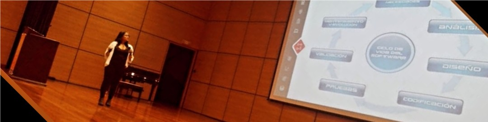

<!-- ## 👋 &nbsp;Hey everyone! I'm Adriana Marcela  -->

   
  <h1 align="center">Hey everyone! I'm Marce </h1>

  <b>Systems Engineer · FrontEnd Developer · Founder @ Iyerly</b> 
  Building digital presence for small businesses — one clean line of code at a time.

<!-- Portada -->

  

<!-- Description about me -->
<h2 align="center"> 💬 About Me</h2>

- 🔭 Founder of **[Iyerly](https://iyerly.com)** — a digital presence agency helping small & medium businesses build their web identity
- 💼 FrontEnd Developer & Product Manager for Technology
- 💻 Software Development Technician & Systems and Telecommunications Engineer
- 🌱 Currently improving my English and diving deeper into AI-assisted development workflows
- 🌎 Based in Myrtle Beach, SC · Colombian roots 🇨🇴

 

<h3 align="center">🛠️ &nbsp;Tech Stack</h3>

  
  
  
  
  

 

<h3 align="center">🚀 &nbsp;Currently Building</h3>
<table align="center">
  <tr>
    <td align="center" width="300">
      <b>Iyerly</b> 
      Digital presence agency for SMBs 
      <a href="https://iyerly.com">iyerly.com</a>
    </td>
    <td align="center" width="300">
      <b>Personal Portfolio</b> 
      Vanilla HTML/CSS/JS, fully responsive 
      <a href="#">Live demo →</a>
    </td>
  </tr>
</table>

 

### 📫 &nbsp;Connect with Me
📧 Feel free to reach out for inquiries or collaborations: **adriana.mgi369@gmail.com**

  

### 🔗 &nbsp;My Social Networks

    
    

 

<!-- GitHub stats section -->
<h2 align="center">⚙️ &nbsp;GitHub Analytics</h2>

  
  

